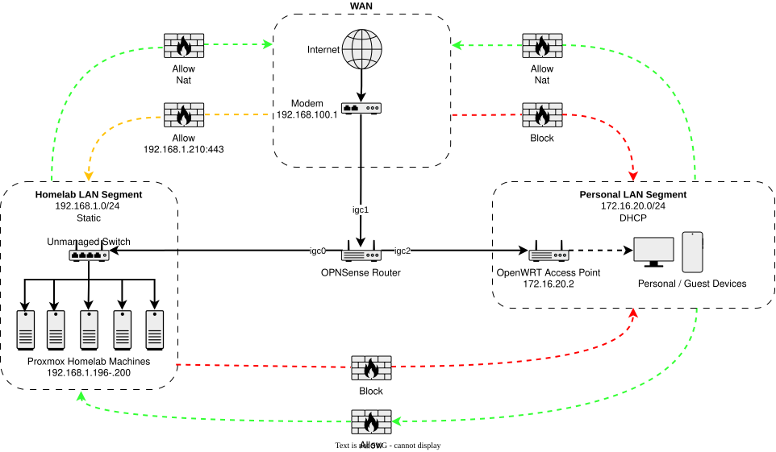
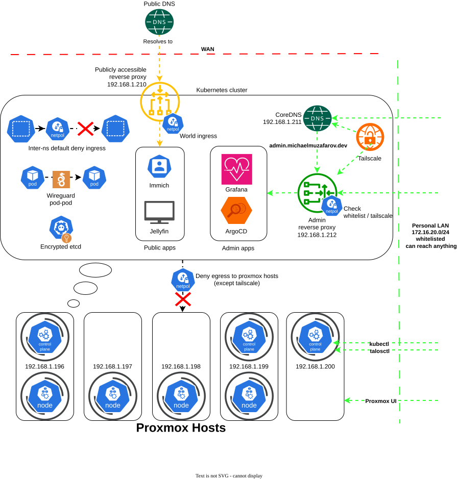
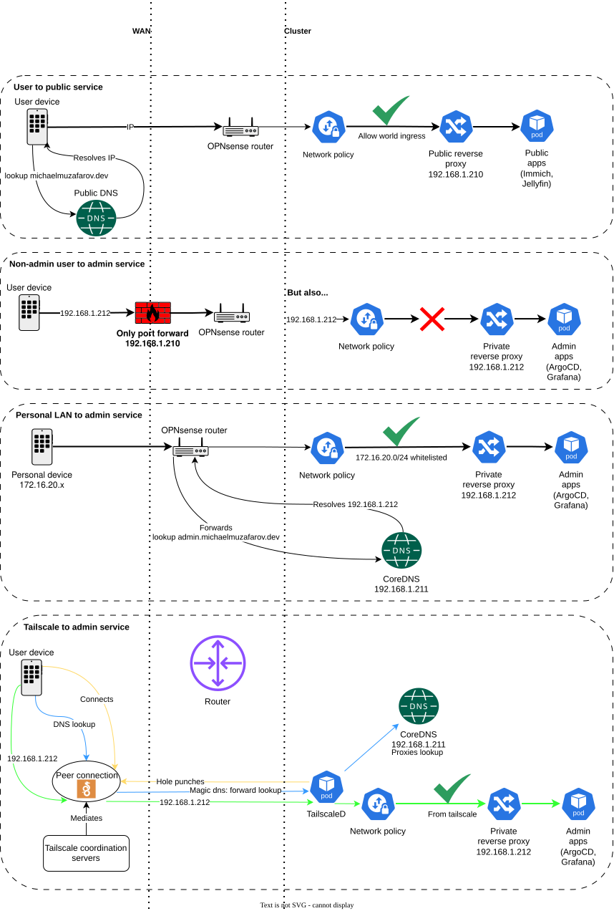
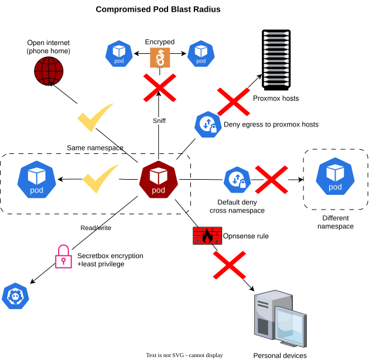

## Intro

Welcome to my homelab!

It's mostly an excuse to learn Kubernetes and networking, but it just so happens to run some cool services.

If you want to be a user let me know, I am happy to share.

You are probably reading this on my public homelab fork - I update it periodically to show off some progress but the main repo isn't public so I don't leak a secret or something.

Below is a walkthrough of my home network and how I have structured it.

## Network topology

- OPNsense segments network into homelab LAN (`192.168.1.0/24`) and personal LAN (`172.16.20.0/24`)
- Personal subnet can reach the homelab for admin access, but the homelab cannot initiate connections to personal subnet
- WAN forwards port 443 (HTTPS) and 6881 (BitTorrent) to public Envoy gateway (`192.168.1.210`); all other inbound WAN traffic is blocked

## Cluster architecture

- Default deny cross-namespace ingress. 
- Public Envoy gateway (`192.168.1.210`) is world-accessible; private Envoy gateway (`192.168.1.212`) only allows Tailscale and the personal LAN
- Public apps only reachable through public Envoy, admin apps only through the private Envoy
- Admin services are password-less, network position is credential
- Public (`*michaelmuzafarov.dev`) domain/s resolves to public Envoy IP
- OPNsense and Tailscale Magic DNS forward `michaelmuzafarov.dev` lookups to in-cluster CoreDNS (`192.168.1.211`), which routes admin subdomains to the private Envoy and everything else to the public Envoy
- TLS terminates at the Envoy gateways; all pod-to-pod traffic is WireGuard encrypted via Cilium; etcd secrets encrypted at rest with secretbox;
- Auth endpoints on public apps are rate limited via BackendTrafficPolicy
- Only controlled egress is a deny to Proxmox management IPs; all other egress is unrestricted
- Nodes run Talos OS - immutable, hardened, no ssh access, designed for k8s
- Many more admin and public apps beyond what is shown

## Traffic flows

- Public services reachable from open internet through OPNsense port forwarding
- Admin services only reachable via Tailscale (remote) or personal LAN (local)
- Tailscale's advertised subnet also covers Proxmox management IPs - deliberate tradeoff for admin convenience
- External users cannot reach admin services, blocked at both OPNsense and network policy

## Compromised pod blast radius

- This shows a typical pod; privileged workloads like Tailscale and monitoring have broader access by necessity, which is a deliberate tradeoff
- Compromised pod can phone home to open internet, blocking all egress adds too much complexity for our threat model
- Same-namespace lateral movement is allowed; namespaces are kept tightly scoped to limit blast radius
- Cross-namespace traffic, Proxmox hosts, and personal devices are all unreachable
